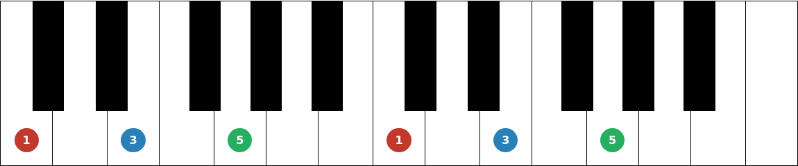
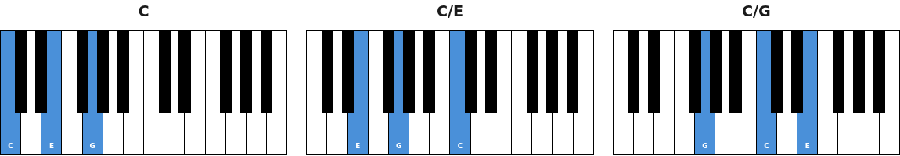
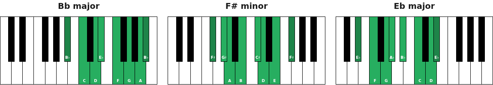
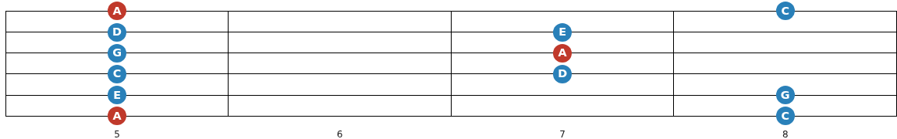
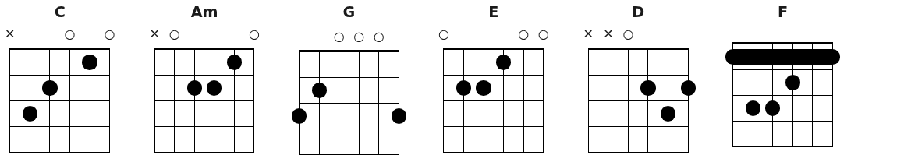
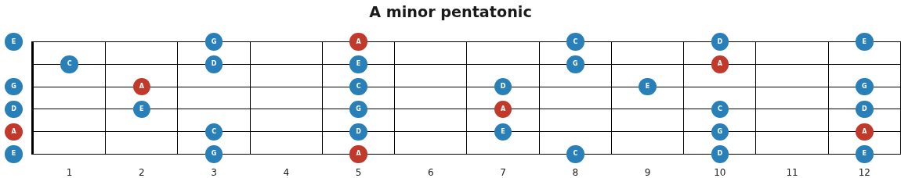

# musiq

Web Components for rendering musical instruments, chords, and scales. Built with [Lit](https://lit.dev/).

**[Docs & demos](https://hsablonniere.github.io/musiq/)**

## Install

```bash
npm install @hsablonniere/musiq
```

```js
import '@hsablonniere/musiq';
```

[](https://www.npmjs.com/package/@hsablonniere/musiq)

## Components

### `<mq-piano>`

Piano keyboard with realistic key geometry. Configurable range, `accurate` or `centered` black key positioning, `preserve-ratio` for real-world proportions. Stylable via `::part()` and CSS custom properties. Named slots (`note-C3`, `note-Fs4`…) for per-key annotations.

**[Docs & demos](https://hsablonniere.github.io/musiq/src/mq-piano/mq-piano.html)**



### `<mq-piano-chord>`

Piano keyboard with chord visualization. Pass a chord name, get highlighted keys. Supports inversions via slash chords (`C/E`, `C/G`), `note-labels`, and customizable active color.

**[Docs & demos](https://hsablonniere.github.io/musiq/src/mq-piano-chord/mq-piano-chord.html)**



### `<mq-piano-scale>`

Piano keyboard with scale visualization. Major, minor, pentatonic, blues, modes (dorian, phrygian, lydian…), and more. Distinct root color, `note-labels`, and `degree-labels`.

**[Docs & demos](https://hsablonniere.github.io/musiq/src/mq-piano-scale/mq-piano-scale.html)**



### `<mq-fretboard>`

Guitar/bass fretboard with slot-based content placement. The component positions, you style. Horizontal or vertical orientation, configurable string count and fret range, `inlays`, `full-neck`, `left-handed`, and multi-string span slots for barres via `extra-slots`.

**[Docs & demos](https://hsablonniere.github.io/musiq/src/mq-fretboard/mq-fretboard.html)**



### `<mq-fretboard-chord>`

Fretboard with chord diagram. Pass a chord name, get finger positions with open/muted string indicators and barre support. Guitar and ukulele, multiple voicings via `position`, `finger-labels`, and `left-handed`.

**[Docs & demos](https://hsablonniere.github.io/musiq/src/mq-fretboard-chord/mq-fretboard-chord.html)**



### `<mq-fretboard-scale>`

Fretboard with scale visualization across the full neck. Custom tunings (drop D, ukulele…), configurable fret range, `note-labels`, `degree-labels`, and `left-handed`.

**[Docs & demos](https://hsablonniere.github.io/musiq/src/mq-fretboard-scale/mq-fretboard-scale.html)**



## License

[MIT](./LICENSE)
